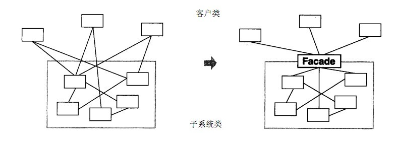

外观模式
概述
有些人可能炒过股票，但其实大部分人都不太懂，这种没有足够了解证券知识的情况下做股票是很容易亏钱的，刚开始炒股肯定都会想，如果有个懂行的帮帮手就好，其实基金就是个好帮手，支付宝里就有许多的基金，它将投资者分散的资金集中起来，交由专业的经理人进行管理，投资于股票、债券、外汇等领域，而基金投资的收益归持有者所有，管理机构收取一定比例的托管管理费用。

定义：
又名门面模式，是一种通过为多个复杂的子系统提供一个一致的接口，而使这些子系统更加容易被访问的模式。该模式对外有一个统一接口，外部应用程序不用关心内部子系统的具体的细节，这样会大大降低应用程序的复杂度，提高了程序的可维护性。

外观（Facade）模式是“迪米特法则”的典型应用

结构
外观（Facade）模式包含以下主要角色：
外观（Facade）角色：为多个子系统对外提供一个共同的接口。
子系统（Sub System）角色：实现系统的部分功能，客户可以通过外观角色访问它。

案例
【例】智能家电控制

小明的爷爷已经60岁了，一个人在家生活：每次都需要打开灯、打开电视、打开空调；睡觉时关闭灯、关闭电视、关闭空调；操作起来都比较麻烦。所以小明给爷爷买了智能音箱，可以通过语音直接控制这些智能家电的开启和关闭。

好处：
降低了子系统与客户端之间的耦合度，使得子系统的变化不会影响调用它的客户类。
对客户屏蔽了子系统组件，减少了客户处理的对象数目，并使得子系统使用起来更加容易。
缺点：
不符合开闭原则，修改很麻烦

使用场景
对分层结构系统构建时，使用外观模式定义子系统中每层的入口点可以简化子系统之间的依赖关系。
当一个复杂系统的子系统很多时，外观模式可以为系统设计一个简单的接口供外界访问。
当客户端与多个子系统之间存在很大的联系时，引入外观模式可将它们分离，从而提高子系统的独立性和可移植性。