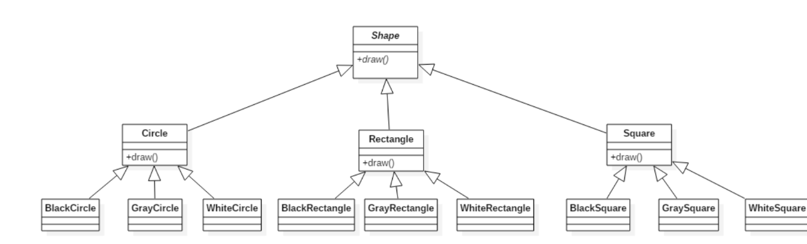

桥接模式 
概述
现在有一个需求，需要创建不同的图形，并且每个图形都有可能会有不同的颜色。我们可以利用继承的方式来设计类的关系：

我们可以发现有很多的类，假如我们再增加一个形状或再增加一种颜色，就需要创建更多的类。

试想，在一个有多种可能会变化的维度的系统中，用继承方式会造成类爆炸，扩展起来不灵活。每次在一个维度上新增一个具体实现都要增加多个子类。为了更加灵活的设计系统，我们此时可以考虑使用桥接模式。

定义：
将抽象与实现分离，使它们可以独立变化。它是用组合关系代替继承关系来实现，从而降低了抽象和实现这两个可变维度的耦合度。

结构
桥接（Bridge）模式包含以下主要角色：
    抽象化（Abstraction）角色 ：定义抽象类，并包含一个对实现化对象的引用。
    扩展抽象化（Refined Abstraction）角色 ：是抽象化角色的子类，实现父类中的业务方法，并通过组合关系调用实现化角色中的业务方法。
    实现化（Implementor）角色 ：定义实现化角色的接口，供扩展抽象化角色调用。
    具体实现化（Concrete Implementor）角色 ：给出实现化角色接口的具体实现。

好处：
桥接模式提高了系统的可扩充性，在两个变化维度中任意扩展一个维度，都不需要修改原有系统。
如：如果现在还有一种视频文件类型wmv，我们只需要再定义一个类实现VideoFile接口即可，其他类不需要发生变化。
实现细节对客户透明

使用场景
当一个类存在两个独立变化的维度，且这两个维度都需要进行扩展时。
当一个系统不希望使用继承或因为多层次继承导致系统类的个数急剧增加时。
当一个系统需要在构件的抽象化角色和具体化角色之间增加更多的灵活性时。避免在两个层次之间建立静态的继承联系，通过桥接模式可以使它们在抽象层建立一个关联关系。
