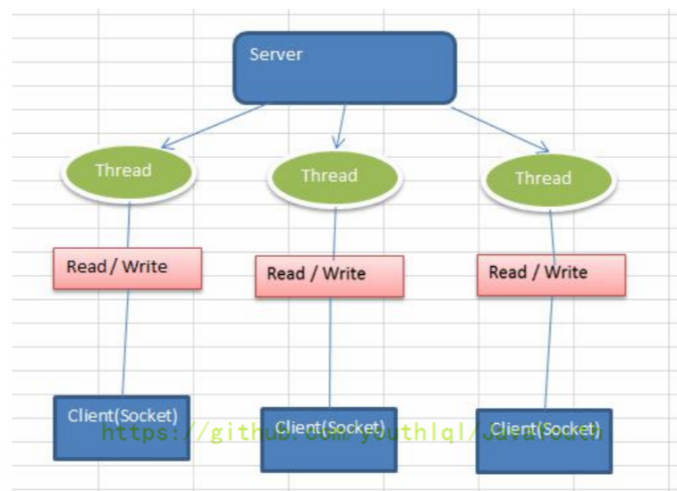
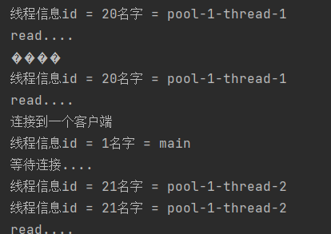

Java BIO：同步并阻塞（传统阻塞型），服务器实现模式为一个连接一个线程，即客户端有连接请求时服务器端就需要启动一个线程进行处理，如果这个连接不做任何事情会造成不必要的线程开销。

BIO 方式适用于连接数目比较小且固定的架构，这种方式对服务器资源要求比较高，并发局限于应用中，JDK1.4 以前的唯一选择，但程序简单易理解。

Java BIO 就是传统的 Java I/O 编程，其相关的类和接口在 java.io。
BIO(BlockingI/O)：同步阻塞，服务器实现模式为一个连接一个线程，即客户端有连接请求时服务器端就需要启动一个线程进行处理，如果这个连接不做任何事情会造成不必要的线程开销，可以通过线程池机制改善（实现多个客户连接服务器）。【后有应用实例】
BIO 方式适用于连接数目比较小且固定的架构，这种方式对服务器资源要求比较高，并发局限于应用中，JDK1.4 以前的唯一选择，程序简单易理解。

对 BIO 编程流程的梳理

服务器端启动一个 ServerSocket。
客户端启动 Socket 对服务器进行通信，默认情况下服务器端需要对每个客户建立一个线程与之通讯。
客户端发出请求后，先咨询服务器是否有线程响应，如果没有则会等待，或者被拒绝。
如果有响应，客户端线程会等待请求结束后，再继续执行。
